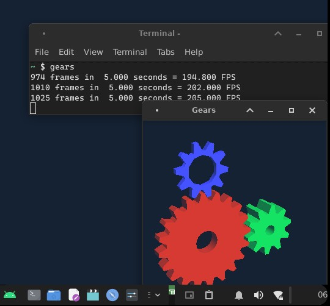

# Termux-sparkle
This will teach you how to use sparkle(Wayland server) in termux desktops

# Screenshot

     

# Type this command
nano sparkle.sh
# Now paste these lines into it
#!$PREFIX/bin/bash

set -e 

XDG_RUNTIME_DIR=/data/data/com.sion.sparkle/files Xwayland &

sleep 1

export DISPLAY=:0

dbus-launch xfce4-session &
#############################
if you get too much output and don't want it then redirect the output to /tmp

change the last line from dbus-launch xfce4-session & to dbus-launch xfce4-session & >> $PREFIX/tmp/$RANDOM.txt

Note: replace xfce4-session with your session
# Now setup sparkle app
Open sparkle and click on edit user.sh
Now delete everything and click save
# Now click start button and type sh sparkle.sh in termux
